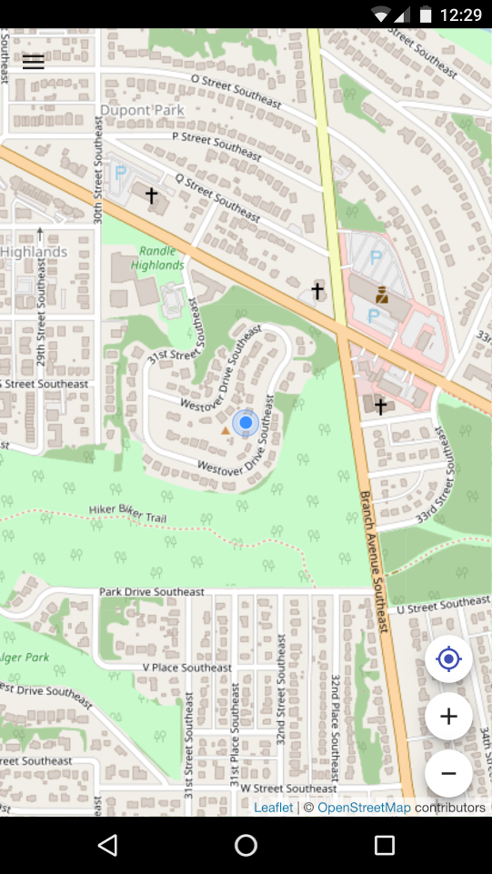

# MAPP

A quick start for leaflet + react + material(using [material-ui.com](https://material-ui.com)) based PWAs

This project was bootstrapped with [Create React App](https://github.com/facebook/create-react-app)
and uses [Material UI](https://material-ui.com/) for the widgets and uses
[Leaflet](https://leafletjs.com) for the map.

If credentials are set up
`master` is automatically deployed dev and github releases are deployed to prod.

## Available Scripts

### `npm start`

Runs the app in the development mode. 
Open [http://localhost:3000](http://localhost:3000) to view it in the browser.

The page will reload if you make edits. 
You will also see any lint errors in the console.

### `npm test`

Launches the test runner in the interactive watch mode. 
See the section about [running tests](https://facebook.github.io/create-react-app/docs/running-tests) for more information.

### `npm run build`

Builds the app for production to the `build` folder. Doesn't need to be run manually, it gets
automatically deployed to gitlab pages from the master branch.

### Rebranding

Since this is meant to be a starting point, here's the main things you need to change to rebrand the app:

#### Name & Copy
You'll want to change the name  and other copy in the following places:
 * `name` in` package.json`
 * `<title>` in `public/index.html`
 * `name`, `short_name`, `description`, and `scope` in `public/manifest.jxon`
 * Descriptive copy & authorship credits in `src/components/Help.js`
 * `DOMAIN` in `deploy`
 * in `src/components/IosPwaPrompt.js`

#### Icons
Use https://romannurik.github.io/AndroidAssetStudio/icons-launcher.html to create an icon and
replace the `ic_launcher` folder in `public` with the one you download from the generator.
